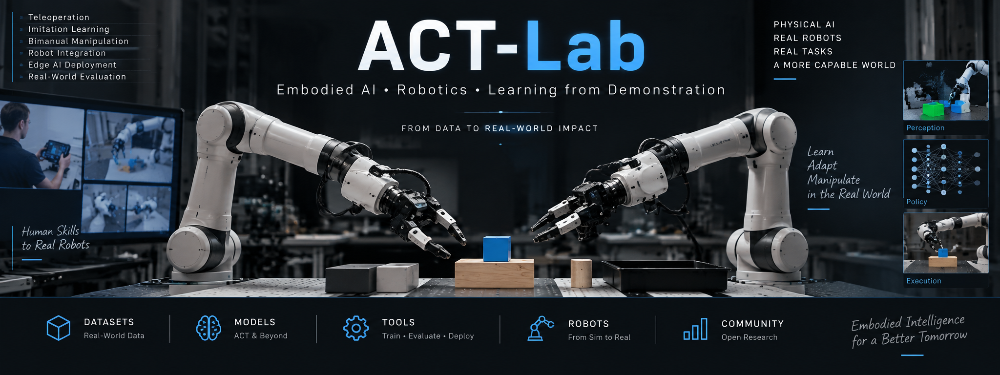
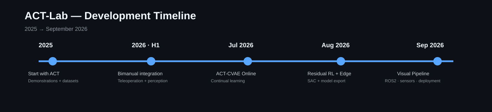
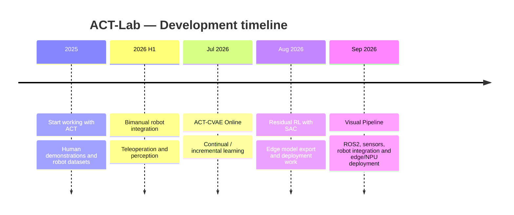

  

<h1 align="center">ACT-Lab</h1>

  <strong>Embodied AI · Robotics · Learning from Demonstration · Physical AI</strong>

  Research and development around real-world robot learning, bimanual manipulation,
  teleoperation, ACT/ACT-CVAE, continual learning, perception, edge deployment and
  integration with physical robotic platforms.

---

## About

**ACT-Lab** is an evolving research environment focused on bringing learned robot
policies from demonstrations and simulation into real robotic systems.

The repository is intentionally minimal for now. It will progressively host
software, examples, datasets, models, deployment tools and documentation developed
around the ACT-Lab ecosystem.

---

## Timeline

  

> The timeline is intentionally high-level and can be refined as project milestones,
> publications and releases are consolidated.

---

## Latest videos

The videos below are ordered **from the most recent to the oldest**, following the
sequence provided for this repository.

### 1. ACT-Lab video

[Watch on YouTube](https://www.youtube.com/watch?v=_0quxTr4MLg&t=15s)

### 2. ACT-Lab video

[Watch on YouTube](https://www.youtube.com/watch?v=uK-TQESARvs)

### 3. ACT-Lab video

[Watch on YouTube](https://www.youtube.com/watch?v=-VzGDfOPEuo)

### 4. ACT-Lab video

[Watch on YouTube](https://www.youtube.com/watch?v=Kb4PaaX3YAw&t=20s)

### 5. ACT-Lab video

[Watch on YouTube](https://www.youtube.com/watch?v=KcHD1WBckBg)

---

## LinkedIn

Project updates, demonstrations and featured posts:

[**LinkedIn — Featured posts by Jaime Andrés Rincón Arango**](https://www.linkedin.com/in/jaime-andres-rincon-arango-11a1522b/details/featured/)

---

## Current research directions

- ACT / ACT-CVAE for robot manipulation
- Bimanual robotic learning
- Learning from demonstration
- Continual and incremental learning
- Residual reinforcement learning
- Visual perception and multimodal sensing
- ROS 2 and robot interoperability
- Edge AI and NPU deployment
- Physical AI and real-world evaluation

---

## Repository status

> **Early public repository / work in progress**

The repository currently contains the project overview and media index. Code,
installation instructions, reproducible experiments and model releases will be
added progressively.

---

## License

### Software and source code

Unless otherwise stated, the software and source code in this repository are
licensed under the **PolyForm Noncommercial License 1.0.0**.

You may use, study, modify, and redistribute the software for **non-commercial
purposes**, including:

- academic and scientific research,
- education and teaching,
- personal projects,
- maker and hobbyist activities,
- non-commercial prototyping and experimentation.

**Commercial use is not permitted without prior written authorization from the
copyright holder.**

This includes, among other things, incorporating the software into commercial
products or services, selling access to derived systems, or using the software
as part of a revenue-generating offering without explicit permission.

### Documentation, figures, diagrams, and media

Unless otherwise stated, original documentation, figures, diagrams, and media
created specifically for ACT-Lab are made available under the
**Creative Commons Attribution-NonCommercial 4.0 International (CC BY-NC 4.0)**
license.

This means these materials may be shared and adapted for non-commercial purposes,
provided appropriate attribution is given.

### Third-party components

Third-party libraries, datasets, models, media, trademarks, and external
resources referenced or included in this repository remain subject to their own
licenses and terms. Their inclusion does not override those terms.

### Commercial licensing

If you are interested in commercial use, industrial deployment, technology
transfer, or other uses outside the non-commercial terms above, please contact
the repository author to discuss a separate commercial license or collaboration
agreement.

Copyright © 2025–2026 Jaime Andrés Rincón Arango.

## Contact

**Dr. Jaime Andres Rincón Arango**  
University of Burgos

For current project activity, demonstrations and updates, see the LinkedIn and
YouTube links above.
